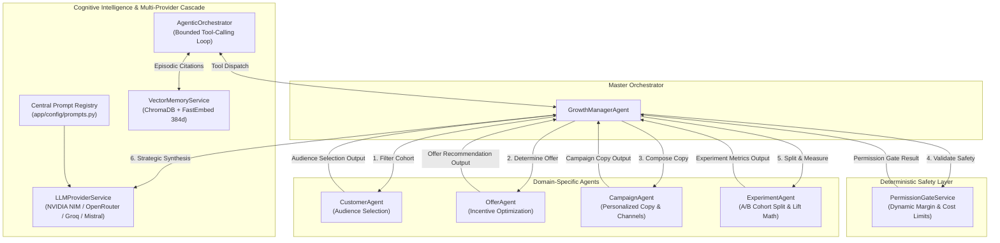

# Autonomous Multi-Agent System Specification

## 1. Multi-Agent Collaboration Model

RazorGrowth AI decomposes growth decision-making into role-specialized autonomous agents rather than relying on a single monolithic prompt. Each agent has a single responsibility, deterministic input/output contracts backed by Pydantic schemas, and fallback heuristic paths to guarantee reliability when LLM APIs are offline.



---

## 2. Detailed Agent Specifications

### 2.1 GrowthManagerAgent (Master Orchestrator)
- **File**: `app/agents/growth_manager_agent.py`
- **Role**: Coordinates the entire growth analysis lifecycle. Ingests raw store data, invokes the analytical intelligence layer, orchestrates specialized agents, verifies permission gates, calls the LLM for executive summaries, and packages the complete `GrowthPlanOutput`.
- **Inputs**: `merchant_id: str`, `session: AsyncSession`
- **Outputs**: `GrowthPlanOutput` containing top opportunities, structured audience, offer details, campaign copy, permission gate status, and AI strategic reasoning.

**Code Example:**
```python
class GrowthManagerAgent:
    """Master orchestrator integrating ContextEngine, specialized agents, and Permission Gates."""

    def __init__(self) -> None:
        self._customer_agent = CustomerAgent()
        self._offer_agent = OfferAgent()
        self._campaign_agent = CampaignAgent()

    async def execute_full_growth_scan(
        self, session: AsyncSession, merchant_id: str
    ) -> dict:
        # 1. Ingest telemetry and detect opportunities
        # 2. Audience selection via CustomerAgent
        # 3. Offer selection via OfferAgent
        # 4. Copy creation via CampaignAgent
        # 5. Permission Gate evaluation via PermissionGateService
        # 6. Strategic synthesis via LLMService
        ...
```

---

### 2.2 CustomerAgent (Audience Selection)
- **File**: `app/agents/customer_agent.py`
- **Role**: Filters and prioritizes target customers based on RFM segment, churn risk score, and predicted CLV. Ensures high-risk or low-margin customers are handled appropriately.
- **Filtering Rules**:
  - **VIP Dormant**: Customers in `VIP Dormant` or `Loyal At Risk` segments with historical spend >= 5,000 INR.
  - **Active Cohorts**: Customers with churn risk < 0.60 and at least 1 historical order.
  - **Ranking**: Sorted by `(total_spend_amount, predicted_lifetime_value)` descending.
- **Output Schema**: `AudienceSelectionOutput` with `total_audience_count`, `target_customers` manifest, and `reasoning`.

**Output JSON Example:**
```json
{
  "opportunity_id": "opp_91823a",
  "target_segment": "VIP Dormant",
  "total_audience_count": 25,
  "target_customers": [
    {
      "customer_id": "cust_101",
      "name": "Priya Sharma",
      "email": "priya.s@example.com",
      "total_spend": 16400.0,
      "total_orders": 7,
      "predicted_clv": 24500.0,
      "churn_risk": 0.72
    }
  ],
  "reasoning": "Selected 25 high-value dormant VIPs with high historical spend but elevated 30-day inactivity."
}
```

---

### 2.3 OfferAgent (Dynamic Incentive Optimization)
- **File**: `app/agents/offer_agent.py`
- **Role**: Computes margin-safe promotional incentives tailored to customer cohort value and average spend.
- **Incentive Matrix**:
  - `VIP Dormant` (Spend >= 8,000 INR): 20% discount (`VIP20OFF`), max discount 2,500 INR, validity 7 days.
  - `VIP Dormant` (Spend < 8,000 INR): 15% discount (`WELCOME15`), max discount 1,500 INR, validity 7 days.
  - `payment_optimization`: 0% discount, 1-Click UPI checkout priority nudge (`UPISWIFT`), validity 24 hours.
  - `Cross-Sell Cohort`: 10% bundle incentive (`BUNDLE10`), max discount 800 INR, validity 5 days.
- **Output Schema**: `OfferRecommendationOutput`

**Output JSON Example:**
```json
{
  "offer_code": "WELCOME15",
  "discount_type": "percentage",
  "discount_value": 15.0,
  "max_discount_inr": 1500.0,
  "min_order_value_inr": 2000.0,
  "urgency_text": "Expires in 7 days",
  "description": "15% off your next purchase up to 1,500 INR",
  "reasoning": "15% incentive balances margin preservation against reactivation probability for 2,900 INR average spend cohort."
}
```

---

### 2.4 CampaignAgent (Personalized Copywriting & Channels)
- **File**: `app/agents/campaign_agent.py`
- **Role**: Formulates multi-channel communication templates (Email, WhatsApp) incorporating dynamic customer attributes, category personalization, and urgency triggers.
- **Channels**: Email, WhatsApp, SMS fallback.
- **Output Schema**: `CampaignCopyOutput`

**Output JSON Example:**
```json
{
  "channel": "email",
  "subject": "Exclusive Apparel gift for Priya",
  "email_body": "Hi Priya,\n\nWe curated something special from our Apparel collection just for you.\nYour exclusive offer: 15% off your next purchase up to 1,500 INR.\n\nExpires in 7 days. Use code WELCOME15 at checkout!",
  "whatsapp_body": "Hey Priya! Grab your exclusive Apparel offer: 15% off with code WELCOME15. Claim: https://stylekart.shop/claim",
  "template_type": "reengagement"
}
```

---

### 2.5 ExperimentAgent (A/B Test Design & Lift Calculation)
- **File**: `app/agents/experiment_agent.py`
- **Role**: Configures randomized cohort splits (80% Treatment / 20% Control) and evaluates mathematical conversion lift, absolute percentage point differences, and counterfactual incremental GMV.
- **Formulas**:
  - Treatment Conversion Rate: `CR_T = Conversions_T / Total_T`
  - Control Conversion Rate: `CR_C = Conversions_C / Total_C`
  - Absolute Difference: `Delta_pp = (CR_T - CR_C) * 100`
  - Relative Lift (when `CR_C > 0`): `Lift = ((CR_T - CR_C) / CR_C) * 100`
  - Relative Lift (when `CR_C = 0`): Handled cleanly as `"N/A (control = 0%)"` to prevent division by zero.
  - Incremental Orders: `Orders_inc = Conversions_T - (Total_T * CR_C)`
  - Incremental Revenue: `GMV_inc = Orders_inc * AOV`
- **Output Schema**: `ExperimentMetricsOutput`

---

## 3. PermissionGateService (Autonomous Safety Guardrails)

- **File**: `app/services/permission_gate_service.py`
- **Role**: Acts as a deterministic security firewall before any action is executed. Evaluates whether a proposed campaign violates store safety guardrails.
- **Dynamic Guardrail Thresholds**:
  - `max_auto_discount`: 20.0%
  - `max_auto_audience`: `max(50, min(300, 0.15 * total_customers))`
  - `max_auto_budget`: `min(50000, max(5000, 0.05 * total_gmv))`
- **Evaluation Statuses**:
  - `AUTO_APPROVED`: Campaign parameters satisfy all cost, audience, and discount limits. Executable immediately.
  - `REQUIRES_MERCHANT_APPROVAL`: Triggers interactive merchant review in the UI with one-click override or safe audience cap options.
  - `REJECTED`: Campaign violates absolute hard limits (> 50% discount).

---

## 4. Multi-Provider LLM & ReAct Tool-Calling Architecture

### 4.1 Zero-Downtime Provider Cascade
`LLMProviderService` (`app/services/llm_provider_service.py`) manages automatic multi-model failover:

1. **Primary**: `nvidia_nim` (`meta/llama-3.3-70b-instruct`) — Ultra low-latency tool-calling and reasoning.
2. **Fallback 1**: `openrouter` (`deepseek/deepseek-chat`) — High-precision economic reasoning.
3. **Fallback 2**: `groq` (`llama-3.3-70b-versatile`) — Fast speculative execution.
4. **Fallback 3**: `mistral` (`mistral-small-latest`) — Concise multilingual reasoning.
5. **Fallback 4**: **Deterministic Heuristic Engine** — Offline analytical rules guaranteeing 100% operational uptime.

### 4.2 Bounded Agentic ReAct Tool Registry
`AgenticOrchestrator` (`app/agents/agentic_orchestrator.py`) empowers the LLM to autonomously inspect telemetry and formulate growth plans via 6 domain tools (`app/agents/tool_registry.py`):

| Tool Name | Scope | Capability |
|---|---|---|
| `get_merchant_context` | PostgreSQL Live Telemetry | Ingests active store GMV, customer count, and payment success rates. |
| `detect_opportunities` | Analytical Intelligence | Discovers ranked revenue leaks and estimated GMV impacts. |
| `select_audience` | CustomerAgent | Formulates filtered cohort manifests based on CLV and churn risk. |
| `recommend_offer` | OfferAgent | Calibrates margin-safe discount parameters and urgency terms. |
| `recall_similar_past_campaigns` | VectorMemoryService (ChromaDB) | Semantically retrieves historical campaign outcomes via FastEmbed 384-dim dense vectors. |
| `check_permission_gate` | PermissionGateService | Validates proposed campaigns against dynamic financial guardrails. |

