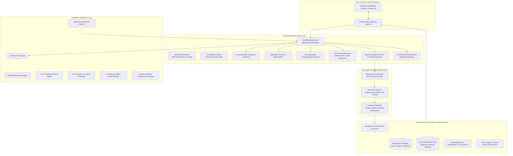
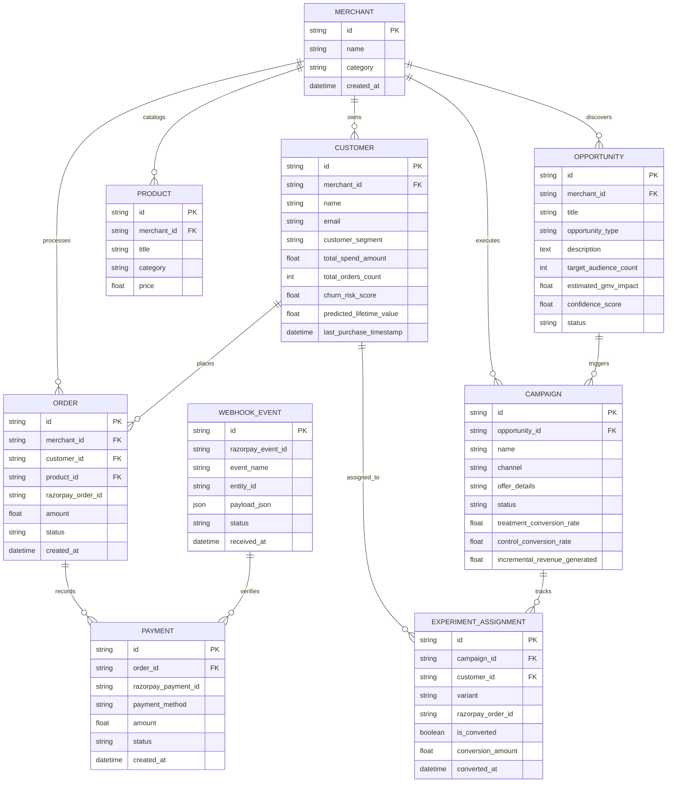

# System Architecture Specification

## 1. Executive Summary

RazorGrowth AI is an autonomous, event-driven growth engine purpose-built for Razorpay merchants. The platform bridges transaction processing infrastructure and autonomous marketing intelligence by operating an automated closed loop: transaction telemetry is continuously ingested, analyzed by an analytical intelligence layer, evaluated by a multi-agent decision system, guarded by deterministic permission gates, executed through real Razorpay checkout workflows, and measured via webhook-driven A/B experiments.

---

## 2. High-Level Architecture Diagram

---

## 3. Layered Architectural Stack

| Layer | Responsibility | Primary Modules |
|---|---|---|
| 1. Simulation & Ingestion | Generates realistic merchant transaction telemetry (500 customers, 2,000 orders) with authentic power-law spend curves. | `app/simulator/` |
| 2. Integration Layer | Communicates with Razorpay REST APIs for order generation and validates incoming HMAC signatures on webhooks. | `app/integrations/` |
| 3. Event Layer | Decoupled asynchronous in-memory event bus broadcasting domain events (`order.paid`, `payment.captured`, `campaign.launched`). | `app/events/` |
| 4. Data & Knowledge Layer | Customer 360 unified profiles, relational PostgreSQL persistence, and JSON session snapshot archiving. | `app/models/`, `app/customer_360/`, `app/schemas/` |
| 5. Intelligence Layer | Deterministic mathematical algorithms for RFM segmentation, churn scoring, predictive CLV, product affinities, and opportunity detection. | `app/intelligence/` |
| 6. Multi-Agent Layer | Role-specialized agents coordinating audience segmentation, incentive economics, messaging copy, and randomized cohort splits. | `app/agents/` |
| 7. Cross-Cutting Services | Real-time webhook lift measurement, deterministic Permission Gate safety evaluation, context aggregation, session tracing, and LLM orchestration. | `app/services/` (`live_experiment_service`, `permission_gate_service`, `context_engine`, `trace_logger_service`, `trace_tool_service`, `llm_service`) |
| 8. Action Layer | Campaign execution engines, template renderers, Razorpay checkout session generators, and message dispatchers. | `app/actions/` |
| 9. API & Interface Layer | High-performance FastAPI asynchronous endpoints, SSE streaming hooks, session trace inspection, and merchant dashboard. | `app/api/`, `app/static/` |

---

## 4. Relational Database Schema and Entity Relationships

The platform utilizes asynchronous PostgreSQL managed via SQLAlchemy 2.0. The connection layer is configured with `NullPool` to ensure connection isolation across asynchronous request boundaries and test runners.

---

## 5. Razorpay Integration Architecture

### 5.1 Order Creation Lifecycle
When a campaign is launched for a target cohort:
1. `ExperimentAgent` splits the eligible audience into Treatment (80%) and Control (20%) cohorts.
2. For treatment customers, `LiveExperimentService` invokes `RazorpayClient.create_order()` with structured metadata notes:
   - `campaign_id`: ID of the running autonomous campaign.
   - `customer_id`: Unique identifier of the target customer.
   - `variant`: `treatment`.
   - `session_id`: Unique active growth management session ID.
3. Order and assignment rows are persisted in `orders` and `experiment_assignments` tables in PostgreSQL.

### 5.2 Webhook Ingestion and Verification
1. Razorpay dispatches `payment.captured` HTTP POST requests to `/api/v1/webhooks/razorpay`.
2. `RazorpayWebhookHandler.verify_signature()` computes `HMAC-SHA256(raw_body, secret)` and validates against the `X-Razorpay-Signature` header in constant time.
3. Raw event is archived in `webhook_events`.
4. `LiveExperimentService.record_webhook_payment()` matches the order via `razorpay_order_id` or notes metadata, marks `experiment_assignments.is_converted = True`, and updates the campaign conversion metrics in PostgreSQL.

---

## 6. Performance and Scalability Guarantees

- **Async I/O Throughout**: Built entirely on asyncpg and FastAPI, eliminating thread blocking on external API calls or database operations.
- **Connection Isolation**: Configured with `NullPool` to guarantee clean event loop lifecycle management under concurrent testing and production reloads.
- **Context Engine Optimization**: Analytical context is pre-aggregated and compressed into targeted key-value summaries before passing to LLM agents, keeping token overhead minimal.
