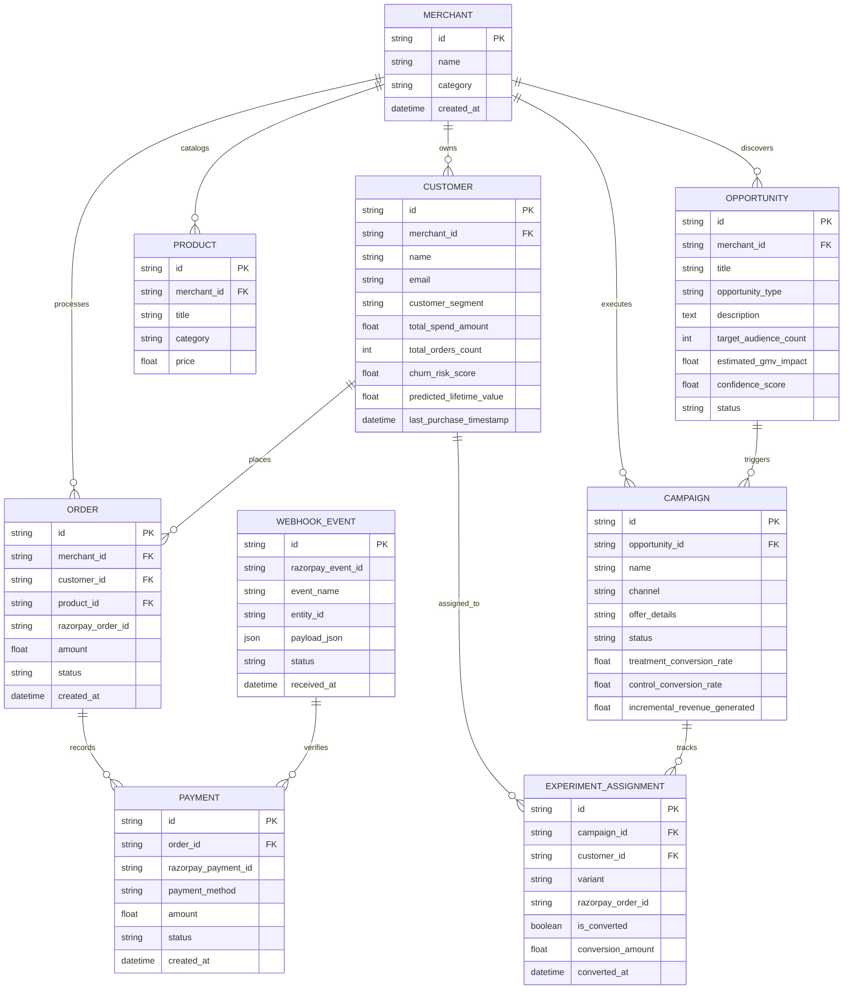
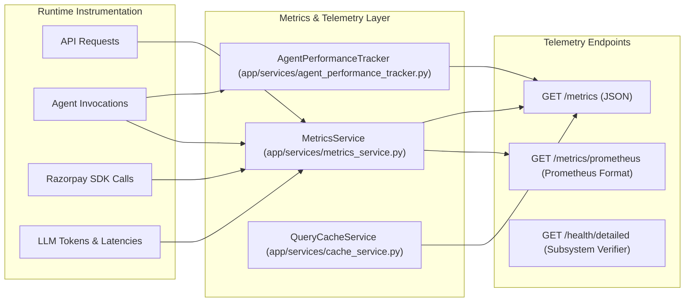

# System Architecture Specification

## 1. Executive Summary

RazorGrowth AI is an autonomous, event-driven growth engine purpose-built for Razorpay merchants. The platform bridges transaction processing infrastructure and autonomous marketing intelligence by operating an automated closed loop: transaction telemetry is continuously ingested, analyzed by an analytical intelligence layer, evaluated by a multi-agent decision system, guarded by deterministic permission gates, executed through real Razorpay checkout workflows, and measured via webhook-driven A/B experiments.

---

## 2. High-Level Architecture Diagram

```mermaid
graph TD
    subgraph ClientLayer["User Interface and API Gateway"]
        UI["Merchant Dashboard (Next.js 16 / React 19 / TypeScript)"]
        API["FastAPI REST Gateway (/api/v1)"]
        SSE["Server-Sent Events (SSE) Streaming Channel"]
        METRICS_EP["Prometheus & JSON Metrics (/metrics)"]
    end

    subgraph OrchestrationLayer["Autonomous Multi-Agent & Consensus Layer"]
        GMA["GrowthManagerAgent (Master Orchestrator)"]
        AG_ORCH["AgenticOrchestrator (Bounded ReAct Tool Loop)"]
        TOOL_REG["ToolRegistry (6 Domain Micro-Tools)"]
        CONSENSUS["AgentConsensusBuilder (Confidence-Weighted / Majority)"]
        CA["CustomerAgent (Audience Selection)"]
        OA["OfferAgent (Incentive Optimization)"]
        CPA["CampaignAgent (Copywriting & Channel)"]
        EA["ExperimentAgent (Cohort & Lift Mathematics)"]
        PG["PermissionGateService (Deterministic Financial Guardrails)"]
        LLM["LLMProviderService (3-Tier Multi-Provider Cascade)"]
    end

    subgraph IntelligenceLayer["Analytical Intelligence Layer"]
        C360["Customer 360 Engine"]
        RFM["RFM Segmentation Engine (6 Behavioral Cohorts)"]
        CHURN["Churn Predictor (Decay Model)"]
        CLV["CLV Estimator (12-Month Predictive)"]
        AFF["Co-Purchase Affinity Recommender"]
        PMA["Payment Method Performance Analyzer"]
        OD["Opportunity Detection Engines"]
    end

    subgraph ObservabilityLayer["Observability, Caching & Performance"]
        METRICS["MetricsService (Counters, Gauges, Histograms)"]
        PERF_TRACKER["AgentPerformanceTracker (Latency & Success Rates)"]
        CACHE["QueryCacheService (In-Memory Hot-Path Caching)"]
        TRACE_LOGGER["TraceLoggerService (JSON Session Traces)"]
    end

    subgraph ModularExecutionLayer["Modular Experimentation & Execution"]
        EXP_ORD["ExperimentOrderCreator (Razorpay Order Orchestration)"]
        WH_PROC["WebhookPaymentProcessor (HMAC Verification & Dedup)"]
        EXP_CALC["ExperimentMetricsCalculator (A/B Lift & Incremental GMV)"]
        EXP_SVC["LiveExperimentService (Coordinator Facade)"]
    end

    subgraph DataLayer["Persistence & Vector Memory"]
        PGDB[("PostgreSQL Database (Async Engine / NullPool)")]
        VEC_MEM[("ChromaDB Vector Store (384-Dim FastEmbed)")]
        EB["Domain Event Publisher & Consumer"]
    end

    subgraph IntegrationLayer["Razorpay Test Mode Infrastructure"]
        RZP_CLI["Razorpay Client (Orders API / Key Secret Auth)"]
        RZP_WH["Razorpay Webhook Handler (HMAC-SHA256 Verification)"]
        RZP_GW["Razorpay Payment Gateway (Test Mode / UPI / Cards)"]
    end

    UI <--> API
    UI <--> SSE
    API --> GMA
    API --> METRICS_EP
    METRICS_EP --> METRICS
    GMA --> C360
    C360 --> IntelligenceLayer
    OD --> GMA
    GMA --> CA
    GMA --> OA
    GMA --> CPA
    GMA --> PG
    GMA --> CONSENSUS
    GMA --> EXP_SVC
    GMA --> LLM

    EXP_SVC --> EXP_ORD
    EXP_SVC --> WH_PROC
    EXP_SVC --> EXP_CALC

    EXP_ORD --> RZP_CLI
    RZP_CLI --> RZP_GW
    RZP_GW --> RZP_WH
    RZP_WH --> WH_PROC
    WH_PROC --> EB
    EB --> DataLayer
    DataLayer --> API
```

---

## 3. Layered Architectural Stack

| Layer | Responsibility | Primary Modules |
|---|---|---|
| 1. Simulation & Ingestion | Generates realistic merchant transaction telemetry (500 customers, 2,000 orders) with authentic power-law spend curves. | `app/simulator/` |
| 2. Integration Layer | Communicates with Razorpay REST APIs for order generation and validates incoming HMAC signatures on webhooks. | `app/integrations/` |
| 3. Event Layer | Decoupled asynchronous in-memory event bus broadcasting domain events (`order.paid`, `payment.captured`, `campaign.launched`). | `app/events/` |
| 4. Data & Knowledge Layer | Customer 360 unified profiles, relational PostgreSQL persistence, and JSON session snapshot archiving. | `app/models/`, `app/customer_360/`, `app/schemas/` |
| 5. Intelligence Layer | Deterministic mathematical algorithms for RFM segmentation, churn scoring, predictive CLV, product affinities, and opportunity detection. | `app/intelligence/` |
| 6. Multi-Agent Layer | Role-specialized agents coordinating audience segmentation, incentive economics, messaging copy, and consensus resolution. | `app/agents/` (`agent_consensus.py`, `customer_agent.py`, `offer_agent.py`, `campaign_agent.py`, `experiment_agent.py`) |
| 7. Modular Experiment Services | Decomposed lifecycle management for test order creation, webhook verification, and mathematical lift computation. | `app/services/` (`experiment_order_creator.py`, `webhook_payment_processor.py`, `experiment_metrics_calculator.py`, `live_experiment_service.py`) |
| 8. Observability & Caching | Enterprise Prometheus metrics, per-agent latency/accuracy tracking, and in-memory TTL caching. | `app/services/` (`metrics_service.py`, `agent_performance_tracker.py`, `cache_service.py`) |
| 9. LLM & Reasoning Layer | 3-tier benchmarked multi-provider failover (NVIDIA NIM, OpenRouter, Groq, Mistral), bounded ReAct loop, FastEmbed vector memory, and SSE streaming. | `app/services/llm_provider_service.py`, `app/services/llm_service.py`, `app/services/vector_memory_service.py` |
| 10. Interface & Dashboard Layer | Modern Next.js 16 / React 19 merchant dashboard with 5 visual views, live terminal log drawer, and guided tour modal. | `client/src/app/`, `client/src/components/` |

---

## 4. Relational Database Schema and Entity Relationships

The platform utilizes asynchronous PostgreSQL managed via SQLAlchemy 2.0. The connection layer is configured with `NullPool` to ensure connection isolation across asynchronous request boundaries and test runners.

---

## 5. Razorpay Integration Architecture

### 5.1 Order Creation Lifecycle
When a campaign is launched for a target cohort:
1. `ExperimentAgent` splits the eligible audience into Treatment (80%) and Control (20%) cohorts.
2. For treatment customers, `LiveExperimentService` invokes `RazorpayClient.create_order()` with structured metadata notes:
   - `campaign_id`: ID of the running autonomous campaign.
   - `customer_id`: Unique identifier of the target customer.
   - `variant`: `treatment`.
   - `session_id`: Unique active growth management session ID.
3. Order and assignment rows are persisted in `orders` and `experiment_assignments` tables in PostgreSQL.

### 5.2 Webhook Ingestion and Verification
1. Razorpay dispatches `payment.captured` HTTP POST requests to `/api/v1/webhooks/razorpay`.
2. `RazorpayWebhookHandler.verify_signature()` computes `HMAC-SHA256(raw_body, secret)` and validates against the `X-Razorpay-Signature` header in constant time.
3. Raw event is archived in `webhook_events`.
4. `LiveExperimentService.record_webhook_payment()` matches the order via `razorpay_order_id` or notes metadata, marks `experiment_assignments.is_converted = True`, and updates the campaign conversion metrics in PostgreSQL.

---

## 6. Observability, Caching & Performance Architecture

### 6.1 Telemetry Services
- **MetricsService (`app/services/metrics_service.py`)**: Collects Prometheus counters (`http_requests_total`, `agent_executions_total`), gauges (`active_sessions`), and histograms (`agent_execution_duration_ms`, `llm_request_duration_ms`).
- **AgentPerformanceTracker (`app/services/agent_performance_tracker.py`)**: Automatically computes rolling per-agent execution times, min/max/average latencies, and success/failure rates.
- **QueryCacheService (`app/services/cache_service.py`)**: Fast in-memory TTL caching for Customer 360 profiles, RFM cohorts, and opportunity detection sweeps.

---

## 7. How to Access & Navigate the Dashboards

The merchant UI is served at `http://localhost:3000` (FastAPI backend at `http://localhost:8000`).

### 7.1 Dashboard Visual Views & Capabilities

```mermaid
graph TD
    DASH["RazorGrowth Merchant Dashboard (http://localhost:3000)"]
    
    DASH --> TAB1["1. Autonomous Growth Actions (/tab: growth)"]
    DASH --> TAB2["2. Customer 360 & Segments (/tab: customers)"]
    DASH --> TAB3["3. Multi-Agent Traces (/tab: agents)"]
    DASH --> TAB4["4. Razorpay Webhook Lab (/tab: webhooks)"]
    DASH --> TAB5["5. AI Growth Strategist (/tab: chat)"]
    DASH --> DRAWER["Live Terminal & Subsystem Drawer (Header Terminal Button)"]
    DASH --> TOUR["Interactive Guided Tour (Header Demo Tour Button)"]

    TAB1 --> CARD_OPP["AI Opportunity Discovery Cards with GMV Impact"]
    TAB1 --> CARD_GATE["Permission Gate Financial Guardrail Banner"]
    TAB1 --> CARD_AB["Real-Time A/B Experiment Lift Metrics"]

    TAB2 --> RFM_GRID["6 Behavioral RFM Cohort Filters"]
    TAB2 --> CUST_MODAL["Customer Profile Modal with CLV & Risk Scores"]

    TAB3 --> RE_ACT["Bounded ReAct Tool Trace & ChromaDB Citations"]
    TAB3 --> PIPE_CARDS["Visual Step-by-Step Execution Cards (No Raw JSON)"]

    TAB4 --> WH_STREAM["Live Webhook Event Feed & HMAC Validation"]
    TAB4 --> WH_TRIG["Direct In-UI Webhook Payment Trigger Simulator"]

    TAB5 --> SSE_CHAT["Token-by-Token Streaming Growth Copilot"]
    TAB5 --> TOOL_PILLS["Grounding Micro-Tool Attribution Badges"]
```

### 7.2 View-by-View Navigation Guide

1. **Autonomous Growth Actions (`tab: growth`)**:
   - **How to view**: Click the **Autonomous Growth Actions** tab in the main navigation bar.
   - **What it shows**: Discovered revenue opportunities (e.g., *Proactive Churn Intervention*, *VIP Dormant Winback*), AI strategic reasoning diagnosis, financial permission gate budget status, and live A/B experiment scorecards showing treatment vs control conversion rates, percentage point lift, and net incremental GMV.
   - **Interactive Actions**: Click **"Launch Autonomous Action"** to execute a margin-safe campaign, or click **"Simulate Razorpay Webhook Payment"** to trigger live payment verification.

2. **Customer 360 & Segments (`tab: customers`)**:
   - **How to view**: Click the **Customer 360 & Segments** tab.
   - **What it shows**: Customer database partitioned into 6 behavioral cohorts (*VIP Active, VIP Dormant, Loyal, At Risk, One-Time, New*), RFM scores, estimated 12-month CLV, churn risk scores, and primary payment preferences (UPI, Cards, Netbanking).
   - **Interactive Actions**: Click on any customer card to inspect detailed transaction history, average order values, and co-purchase affinities.

3. **Multi-Agent Traces (`tab: agents`)**:
   - **How to view**: Click the **Multi-Agent Traces** tab.
   - **What it shows**: Visual step cards for the 7-stage autonomous pipeline, detailed ReAct tool execution records (6 domain tools), ChromaDB vector memory citations (384-dim FastEmbed), and complete session trace audit logs.

4. **Razorpay Webhook Lab (`tab: webhooks`)**:
   - **How to view**: Click the **Razorpay Webhook Lab** tab.
   - **What it shows**: Real-time incoming webhook stream, HMAC-SHA256 signature verification status, parsed order notes, and linked campaign attribution.
   - **Interactive Actions**: Fire instant test webhook payments to verify closed-loop lift calculation.

5. **AI Growth Strategist (`tab: chat`)**:
   - **How to view**: Click the **AI Growth Strategist** tab.
   - **What it shows**: Conversational copilot powered by multi-provider LLMs with token-by-token Server-Sent Events (SSE) streaming, interactive reasoning accordions, and micro-tool attribution pills.
   - **Suggested Queries**: *"What is my biggest revenue leak?"*, *"Why did you choose this offer code?"*, *"Compare my current session with past benchmarks"*.

6. **Live Terminal & Metrics Inspection**:
   - Click the **Terminal icon** in the top navigation header to toggle the live system log drawer.
   - Access **`http://localhost:8000/metrics`** for JSON metrics, **`http://localhost:8000/metrics/prometheus`** for Prometheus scrapers, and **`http://localhost:8000/health/detailed`** for live subsystem health checks.
