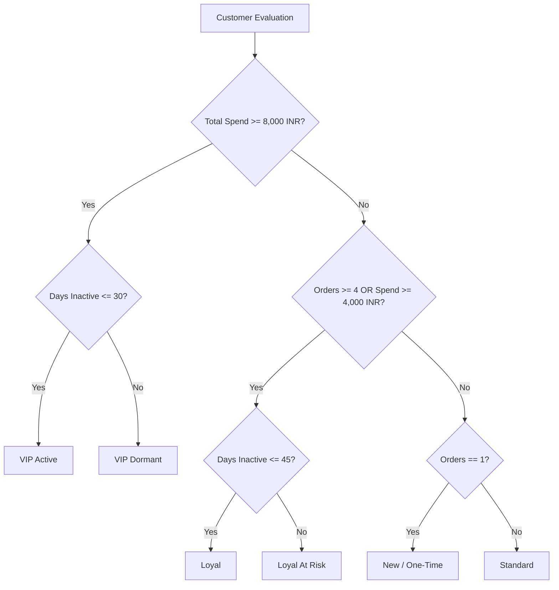

# Analytical Intelligence Layer Specification

## 1. Overview and Data Pipeline

The Analytical Intelligence Layer is a deterministic computational pipeline that converts raw transaction logs into enriched customer intelligence, cohort segments, risk scores, and ranked revenue growth opportunities.

---

## 2. Customer 360 Engine

- **File**: `app/customer_360/metric_calculator.py`, `app/customer_360/profile_builder.py`
- **Purpose**: Computes comprehensive per-customer aggregates from the full order history:
  - `total_spend_amount`: Cumulative sum of paid orders.
  - `total_orders_count`: Count of completed purchases.
  - `average_order_value`: $\frac{\text{total\_spend}}{\text{total\_orders}}$.
  - `last_purchase_timestamp`: Timestamp of most recent successful order.
  - `days_since_last_purchase`: $\text{now} - \text{last\_purchase\_timestamp}$.
  - `preferred_payment_method`: Modal payment method (UPI, Card, Netbanking).
  - `favorite_product_category`: Modal product category purchased.

---

## 3. RFM Customer Segmentation Model

- **File**: `app/intelligence/customer_segmentation.py`
- **Logic**: Classifies customers into 6 distinct behavioral cohorts based on Recency, Frequency, and Monetary spend thresholds.

### Cohort Classification Rules

---

## 4. Churn Risk Prediction Engine

- **File**: `app/intelligence/churn_predictor.py`
- **Model**: A 3-factor composite risk index producing a continuous score between `0.00` (zero risk) and `1.00` (definite churn).

$$\text{Churn Risk} = 0.50 \cdot R_{\text{recency}} + 0.30 \cdot R_{\text{frequency\_decay}} + 0.20 \cdot R_{\text{spend\_decline}}$$

### Factor 1: Recency Risk ($R_{\text{recency}}$)
Evaluates inactivity duration:
- $\le 7\text{ days}$: `0.05`
- $8 - 15\text{ days}$: `0.15`
- $16 - 30\text{ days}$: `0.40`
- $31 - 45\text{ days}$: `0.65`
- $46 - 60\text{ days}$: `0.80`
- $> 60\text{ days}$: `0.95`

### Factor 2: Purchase Interval Growth ($R_{\text{frequency\_decay}}$)
Measures whether the inter-purchase interval between consecutive orders is expanding:
$$\text{Decay Ratio} = \frac{\text{Mean Gap (Second Half of Orders)}}{\text{Mean Gap (First Half of Orders)}}$$
- $\text{Decay Ratio} \le 1.0$: `0.10` (accelerating purchase frequency)
- $1.0 < \text{Decay Ratio} \le 1.5$: `0.40` (slight slowdown)
- $1.5 < \text{Decay Ratio} \le 2.5$: `0.70` (significant deceleration)
- $\text{Decay Ratio} > 2.5$: `0.90` (rapid drop-off)

### Factor 3: Spend Trajectory Decline ($R_{\text{spend\_decline}}$)
Compares Average Order Value of recent orders versus earlier orders:
$$\text{Spend Ratio} = \frac{\text{AOV (Recent Half)}}{\text{AOV (Earlier Half)}}$$
- $\text{Spend Ratio} \ge 1.0$: `0.05` (increasing or stable basket size)
- $0.75 \le \text{Spend Ratio} < 1.0$: `0.30` (mild decline)
- $0.50 \le \text{Spend Ratio} < 0.75$: `0.65` (steep basket drop)
- $\text{Spend Ratio} < 0.50$: `0.90` (severe degradation)

---

## 5. 12-Month Predictive Customer Lifetime Value (CLV)

- **File**: `app/intelligence/clv_estimator.py`
- **Formula**:
$$\text{CLV}_{\text{predicted}} = \text{Historical Spend} + \left( \text{AOV} \times \text{Expected Annual Orders} \times (1 - \text{Churn Risk}) \right)$$

Where:
- $\text{Expected Annual Orders} = \max\left(1.0, \frac{\text{Historical Orders}}{\max(30, \text{Customer Age in Days})} \times 365 \times 0.85\right)$
- Clamped between $1.0 \times \text{Historical Spend}$ and $5.0 \times \text{Historical Spend}$.

---

## 6. Co-Purchase Affinity and Product Recommender

- **File**: `app/intelligence/product_recommender.py`
- **Algorithm**: Association rule mining over multi-item order histories:
  1. Identifies all multi-item baskets or multi-order category pairings.
  2. Builds category-to-category co-purchase count matrix.
  3. Calculates Confidence:
     $$\text{Confidence}(A \rightarrow B) = \frac{\text{Count}(\text{Orders with } A \text{ and } B)}{\text{Count}(\text{Orders with } A)}$$
  4. Filters for candidate customers who have purchased Category $A$ but have zero historical purchases in Category $B$, filtering out high-churn accounts ($\text{churn} < 0.60$).

---

## 7. Payment Method Performance Analyzer

- **File**: `app/intelligence/payment_method_analyzer.py`
- **Benchmark**: Compares observed method success rates against industry standard benchmarks ($92.0\%$ for UPI/Cards).
- **Calculations**:
  - Success Rate: $\frac{\text{Captured Transactions}}{\text{Total Transactions}}$
  - Performance Gap: $\Delta = \text{Benchmark Rate} - \text{Current Rate}$
  - Estimated Lost GMV: $\sum_{\text{failed}} \text{Amount}$
  - Recoverable GMV: $\text{Estimated Lost GMV} \times 0.60$

---

## 8. Dynamic Opportunity Detection Engines

- **File**: `app/intelligence/opportunity_detector.py`

| Opportunity Type | Eligibility Criteria | Estimated GMV Impact | Confidence Score Formula |
|---|---|---|---|
| **Dormant VIP Recovery** | $\ge 3$ customers in `VIP Dormant` or `Loyal At Risk` with spend $\ge 5,000\text{ INR}$ | $\text{Count} \times \text{AOV} \times 0.70$ | $\text{clamp}(0.60 + 1.5 \times \frac{\text{dormant\_vips}}{\text{total\_customers}}, 0.60, 0.92)$ |
| **Payment Method Optimization** | Payment method with $\ge 20$ attempts and success rate $< 92.0\%$ | $\sum \text{Recoverable GMV}$ | $\text{clamp}(0.50 + 2.0 \times (\text{benchmark} - \text{current}), 0.50, 0.95)$ |
| **Cross-Sell Affinity** | Best Category pair $A \rightarrow B$ with confidence $\ge 10\%$ and $\ge 2$ active candidates | $\text{Candidates} \times 1800 \times \text{Confidence}$ | $\text{round}(\text{best\_confidence}, 2)$ |
| **Proactive Churn Intervention** | $\ge 3$ repeat customers with accelerating interval decay and churn risk $0.60 \le \text{risk} < 0.85$ | $\text{Count} \times \text{AOV} \times 0.40$ | $\text{clamp}(0.60 + 1.8 \times \frac{\text{candidates}}{\text{total\_customers}}, 0.60, 0.88)$ |
| **Tiered Basket Builder** | $\ge 3$ active repeat customers ($\ge 3$ orders) with below-average basket spend ($< 2,200\text{ INR}$) | $\text{Count} \times 2 \times \Delta_{\text{AOV}}$ | $0.82\text{ (fixed empirical benchmark)}$ |
