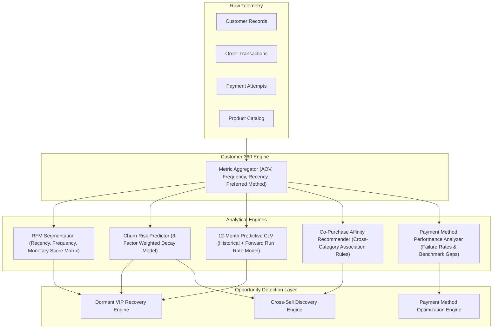
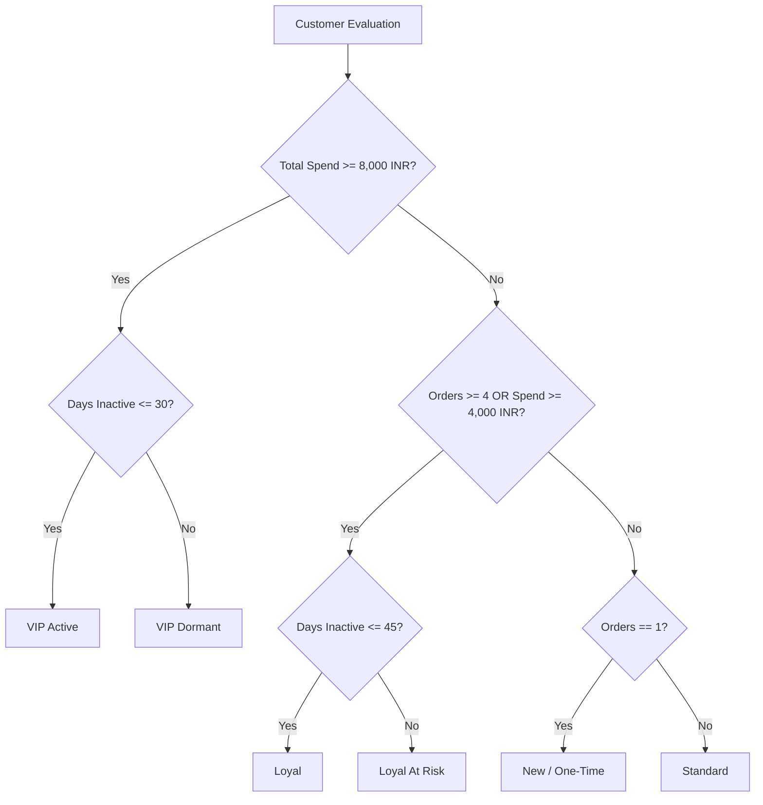

# Analytical Intelligence Layer Specification

## 1. Overview and Data Pipeline

The Analytical Intelligence Layer is a deterministic computational pipeline that converts raw transaction logs into enriched customer intelligence, cohort segments, risk scores, and ranked revenue growth opportunities.



---

## 2. Customer 360 Engine

- **File**: `app/customer_360/metric_calculator.py`, `app/customer_360/profile_builder.py`
- **Purpose**: Computes comprehensive per-customer aggregates from the full order history:
  - `total_spend_amount`: Cumulative sum of paid orders.
  - `total_orders_count`: Count of completed purchases.
  - `average_order_value`: `total_spend / total_orders`.
  - `last_purchase_timestamp`: Timestamp of most recent successful order.
  - `days_since_last_purchase`: `now - last_purchase_timestamp`.
  - `preferred_payment_method`: Modal payment method (UPI, Card, Netbanking).
  - `favorite_product_category`: Modal product category purchased.

---

## 3. RFM Customer Segmentation Model

- **File**: `app/intelligence/customer_segmentation.py`
- **Logic**: Classifies customers into 6 distinct behavioral cohorts based on Recency, Frequency, and Monetary spend thresholds.

### Cohort Classification Rules



---

## 4. Churn Risk Prediction Engine

- **File**: `app/intelligence/churn_predictor.py`
- **Model**: A 3-factor composite risk index producing a continuous score between `0.00` (zero risk) and `1.00` (definite churn).

```
Churn Risk = 0.50 * R_recency + 0.30 * R_frequency_decay + 0.20 * R_spend_decline
```

### Factor 1: Recency Risk (`R_recency`)
Evaluates inactivity duration:
- `<= 7 days`: `0.05`
- `8 - 15 days`: `0.15`
- `16 - 30 days`: `0.40`
- `31 - 45 days`: `0.65`
- `46 - 60 days`: `0.80`
- `> 60 days`: `0.95`

### Factor 2: Purchase Interval Growth (`R_frequency_decay`)
Measures whether the inter-purchase interval between consecutive orders is expanding:
```
Decay Ratio = Mean Gap (Second Half of Orders) / Mean Gap (First Half of Orders)
```
- `Decay Ratio <= 1.0`: `0.10` (accelerating purchase frequency)
- `1.0 < Decay Ratio <= 1.5`: `0.40` (slight slowdown)
- `1.5 < Decay Ratio <= 2.5`: `0.70` (significant deceleration)
- `Decay Ratio > 2.5`: `0.90` (rapid drop-off)

### Factor 3: Spend Trajectory Decline (`R_spend_decline`)
Compares Average Order Value of recent orders versus earlier orders:
```
Spend Ratio = AOV (Recent Half) / AOV (Earlier Half)
```
- `Spend Ratio >= 1.0`: `0.05` (increasing or stable basket size)
- `0.75 <= Spend Ratio < 1.0`: `0.30` (mild decline)
- `0.50 <= Spend Ratio < 0.75`: `0.65` (steep basket drop)
- `Spend Ratio < 0.50`: `0.90` (severe degradation)

---

## 5. 12-Month Predictive Customer Lifetime Value (CLV)

- **File**: `app/intelligence/clv_estimator.py`
- **Formula**:
```
CLV_predicted = Historical Spend + (AOV * Expected Annual Orders * (1 - Churn Risk))
```

Where:
- `Expected Annual Orders = max(1.0, (Historical Orders / max(30, Customer Age in Days)) * 365 * 0.85)`
- Clamped between `1.0 * Historical Spend` and `5.0 * Historical Spend`.

---

## 6. Co-Purchase Affinity and Product Recommender

- **File**: `app/intelligence/product_recommender.py`
- **Algorithm**: Association rule mining over multi-item order histories:
  1. Identifies all multi-item baskets or multi-order category pairings.
  2. Builds category-to-category co-purchase count matrix.
  3. Calculates Confidence:
     ```
     Confidence(A -> B) = Count(Orders with A and B) / Count(Orders with A)
     ```
  4. Filters for candidate customers who have purchased Category A but have zero historical purchases in Category B, filtering out high-churn accounts (`churn < 0.60`).

---

## 7. Payment Method Performance Analyzer

- **File**: `app/intelligence/payment_method_analyzer.py`
- **Benchmark**: Compares observed method success rates against industry standard benchmarks (`92.0%` for UPI/Cards).
- **Calculations**:
  - Success Rate: `Captured Transactions / Total Transactions`
  - Performance Gap: `Delta = Benchmark Rate - Current Rate`
  - Estimated Lost GMV: `Sum of Failed Transaction Amounts`
  - Recoverable GMV: `Estimated Lost GMV * 0.60`

---

## 8. Dynamic Opportunity Detection Engines

- **File**: `app/intelligence/opportunity_detector.py`

| Opportunity Type | Eligibility Criteria | Estimated GMV Impact | Confidence Score Formula |
|---|---|---|---|
| **Dormant VIP Recovery** | ≥ 3 customers in `VIP Dormant` or `Loyal At Risk` with spend ≥ 5,000 INR | `Count * AOV * 0.70` | `clamp(0.60 + 1.5 * (dormant_vips / total_customers), 0.60, 0.92)` |
| **Payment Method Optimization** | Payment method with ≥ 20 attempts and success rate < 92.0% | `Sum of Recoverable GMV` | `clamp(0.50 + 2.0 * (benchmark - current), 0.50, 0.95)` |
| **Cross-Sell Affinity** | Best Category pair `A -> B` with confidence ≥ 10% and ≥ 2 active candidates | `Candidates * 1800 * Confidence` | `round(best_confidence, 2)` |
| **Proactive Churn Intervention** | ≥ 3 repeat customers with accelerating interval decay and churn risk 0.60 ≤ risk < 0.85 | `Count * AOV * 0.40` | `clamp(0.60 + 1.8 * (candidates / total_customers), 0.60, 0.88)` |
| **Tiered Basket Builder** | ≥ 3 active repeat customers (≥ 3 orders) with below-average basket spend (< 2,200 INR) | `Count * 2 * Delta_AOV` | `0.82 (fixed empirical benchmark)` |

