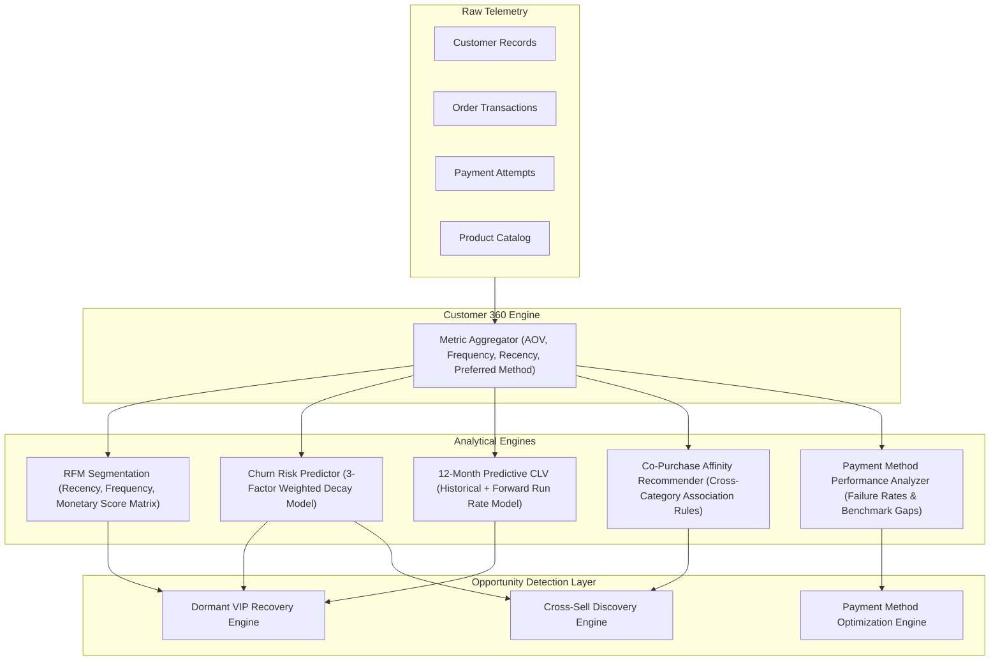
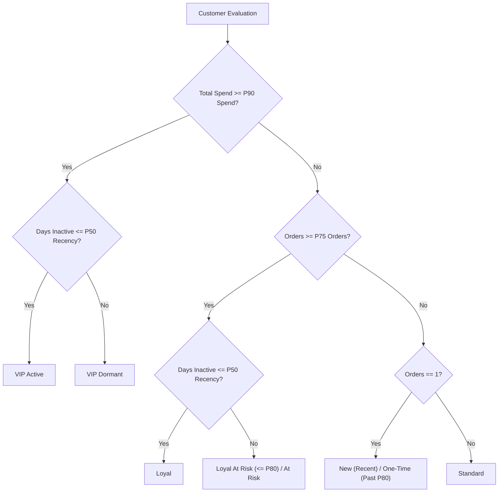

# Analytical Intelligence Layer Specification

## 1. Overview and Data Pipeline

The Analytical Intelligence Layer is a deterministic computational pipeline that converts raw transaction logs into enriched customer intelligence, cohort segments, risk scores, and ranked revenue growth opportunities.



---

## 2. Customer 360 Engine

- **File**: `app/customer_360/metric_calculator.py`, `app/customer_360/profile_builder.py`
- **Purpose**: Computes comprehensive per-customer aggregates from the full order history:
  - `total_spend_amount`: Cumulative sum of paid orders.
  - `total_orders_count`: Count of completed purchases.
  - `average_order_value`: `total_spend / total_orders`.
  - `last_purchase_timestamp`: Timestamp of most recent successful order.
  - `days_since_last_purchase`: `now - last_purchase_timestamp`.
  - `preferred_payment_method`: Modal payment method (UPI, Card, Netbanking).
  - `favorite_product_category`: Modal product category purchased.

---

## 3. Empirical Distribution Quantiles & RFM Segmentation

- **Files**: `app/intelligence/distribution_thresholds.py`, `app/intelligence/customer_segmentation.py`
- **Logic**: Automatically extracts empirical population percentiles ($P_{90}$, $P_{75}$, $P_{50}$) for total spend, order count, and inactivity recency per merchant, ensuring zero hardcoded magic constants.

### Dynamic Quantile Calibration Matrix

```
VIP Spend Threshold (P_90)      = np.percentile(spends, 90)
Loyal Frequency Threshold (P_75)= np.percentile(orders, 75)
Median Recency Days (P_50)      = np.percentile(recencies, 50)
Dormancy Recency Threshold (P_80)= np.percentile(recencies, 80)
RFM Normalization Anchors       = 95th percentile spend, orders, and recency
Payment Success Baseline        = 75th percentile method success rate
```

### Cohort Classification Rules



---

## 4. Churn Risk Prediction Engine

- **File**: `app/intelligence/churn_predictor.py`
- **Model**: A continuous 3-factor composite risk index producing a smooth score between `0.00` (zero risk) and `1.00` (definite churn).

```
Churn Risk = 0.50 * R_recency + 0.30 * R_frequency_decay + 0.20 * R_spend_decline
```

### Factor 1: Smooth Continuous Recency Risk (`R_recency`)
Evaluates inactivity duration as a continuous power CDF against the merchant's 80th-percentile dormancy anchor:
```
R_recency = min(1.0, max(0.02, (days_inactive / (P_80_dormancy * 1.25)) ^ 1.15))
```

### Factor 2: Continuous Purchase Interval Growth (`R_frequency_decay`)
Measures whether the inter-purchase interval between consecutive orders is expanding:
```
Decay Ratio = Mean Gap (Second Half of Orders) / Mean Gap (First Half of Orders)
R_frequency_decay = min(1.0, max(0.05, 0.35 * Decay Ratio))
```

### Factor 3: Spend Trajectory Decline (`R_spend_decline`)
Compares Average Order Value of recent orders versus earlier orders:
```
Spend Ratio = AOV (Recent Half) / AOV (Earlier Half)
R_spend_decline = min(0.95, max(0.05, 1.05 - Spend Ratio))
```

---

## 5. 12-Month Predictive Customer Lifetime Value (CLV)

- **File**: `app/intelligence/clv_estimator.py`
- **Formula**:
```
CLV_predicted = AOV * Annual Frequency Estimate * Churn Discount Factor
```

Where:
- `Annual Frequency Multiplier = 1.15 + (0.75 / (1.0 + 0.35 * ln(Orders + 1)))`
- `Churn Discount Factor = max(0.20, 1.0 - (Churn Risk * 0.60))`
- Clamped with a lower bound of historical spend.

---

## 6. Co-Purchase Affinity and Product Recommender

- **File**: `app/intelligence/product_recommender.py`
- **Algorithm**: Association rule mining over multi-item order histories:
  1. Identifies all multi-item baskets or multi-order category pairings.
  2. Builds category-to-category co-purchase count matrix.
  3. Calculates Confidence:
     ```
     Confidence(A -> B) = Count(Orders with A and B) / Count(Orders with A)
     ```
  4. Filters for candidate customers who have purchased Category A but have zero historical purchases in Category B, filtering out high-churn accounts (`churn < 0.90`).

---

## 7. Payment Method Performance Analyzer

- **File**: `app/intelligence/payment_method_analyzer.py`
- **Benchmark**: Compares observed method success rates against the merchant's empirical $P_{75}$ baseline rate.
- **Calculations**:
  - Success Rate: `Captured Transactions / Total Transactions`
  - Performance Gap: `Delta = Empirical Benchmark Rate - Current Rate`
  - Estimated Lost GMV: `Sum of Failed Transaction Amounts`
  - Recoverable GMV: `Estimated Lost GMV * 0.60`

---

## 8. Distribution-Aware Opportunity Detection Engines

- **File**: `app/intelligence/opportunity_detector.py`

| Opportunity Type | Eligibility Criteria | Estimated GMV Impact | Confidence Score Formula |
|---|---|---|---|
| **Dormant VIP Recovery** | ≥ 2 customers in `VIP Dormant` or `Loyal At Risk` with spend ≥ $P_{90} \times 0.60$ | `Count * AOV * 0.70` | `clamp(0.60 + 1.5 * (dormant_vips / total_customers), 0.60, 0.92)` |
| **Payment Method Optimization** | Payment method with ≥ 5 attempts and success rate < Empirical Baseline | `Sum of Recoverable GMV` | `clamp(0.50 + 2.0 * (benchmark - current), 0.50, 0.95)` |
| **Cross-Sell Affinity** | Best Category pair `A -> B` with confidence ≥ 5% and ≥ 1 active candidates | `Candidates * Median_AOV * Confidence` | `round(max(0.65, best_confidence), 2)` |
| **Proactive Churn Intervention** | ≥ 2 repeat customers with churn risk 0.40 ≤ risk < 0.90 | `Count * Mean_Spend * 0.40` | `clamp(0.60 + 1.8 * (candidates / total_customers), 0.60, 0.88)` |
| **Tiered Basket Builder** | ≥ 2 active repeat customers (≥ 2 orders) with order value < $1.25 \times \text{Median AOV}$ | `Count * 2 * Delta_AOV` | `0.82 (calibrated empirical lift)` |

