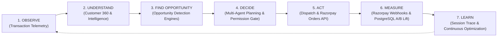
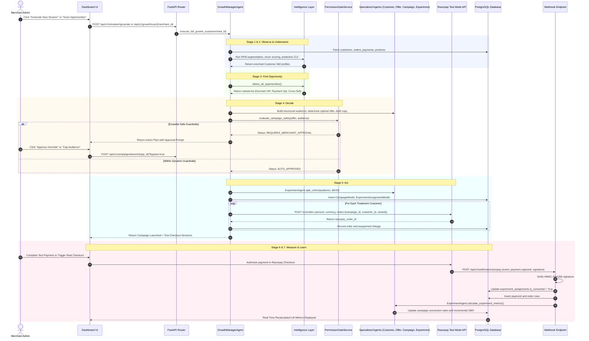

# Autonomous Growth Loop and Workflow Specification

## 1. Overview of the Closed-Loop Cycle

RazorGrowth AI operates an autonomous, continuous 7-stage growth cycle designed around empirical measurement and merchant safety.



---

## 2. Comprehensive End-to-End Sequence Diagram



---

## 3. Detailed Stage-by-Stage Breakdown with Real Payloads

### Stage 1: Observe (Transaction Telemetry)
Raw transaction data is ingested from merchant transactions or initialized via the data generator.

**Example Ingested Customer Record:**
```json
{
  "id": "cust_a79f10d2",
  "name": "Arjun Mehta",
  "email": "arjun.m@example.in",
  "total_spend_amount": 14500.0,
  "total_orders_count": 5,
  "last_purchase_timestamp": "2026-07-10T14:30:00Z"
}
```

---

### Stage 2: Understand (Customer 360 & Analytics)
The Intelligence Layer executes non-linear models to enrich profiles:
- Days Inactive: 42 days -> Churn Risk: `0.65`
- Frequency Interval Decay: `1.42` -> Interval Decay Risk: `0.40`
- Weighted Churn Score: `(0.50 * 0.65) + (0.30 * 0.40) + (0.20 * 0.20) = 0.485`
- Segment Assigned: `VIP Dormant`
- 12-Month Predictive CLV: `14500 + (14500 / 5) * 4.2 * (1 - 0.485) = 20,757.90 INR`

---

### Stage 3: Find Opportunity (Opportunity Detection Engine)
Opportunity detectors scan the cohort distribution for revenue leakage.

**Example Discovered Opportunity:**
```json
{
  "id": "opp_d94f83c19e20",
  "title": "Dormant High-Value Customer Recovery",
  "opportunity_type": "customer_churn_prevention",
  "target_audience_count": 28,
  "estimated_gmv_impact": 56840.00,
  "confidence_score": 0.68,
  "status": "detected"
}
```

---

### Stage 4: Decide (Multi-Agent Planning & Permission Gate)
`GrowthManagerAgent` orchestrates specialized agents:
- `CustomerAgent`: Selects the top 28 candidates sorted by `(total_spend, CLV)`.
- `OfferAgent`: Evaluates average cohort spend (2,900 INR) and selects standard VIP re-engagement incentive: `15% Discount (WELCOME15)`.
- `CampaignAgent`: Generates structured email copy tailored to the customer's favorite category.
- `PermissionGateService`: Verifies total campaign cost against merchant thresholds:
  - Estimated Cost: `28 customers * 2.50 INR dispatch + 15% discount liability = 12,180 INR`
  - Max Allowed Automated Cost: `15,000 INR`
  - Decision: `AUTO_APPROVED`

---

### Stage 5: Act (Campaign Dispatch & Razorpay Orders Creation)
1. `ExperimentAgent` splits the 28 customers:
   - Treatment: 22 customers (80%)
   - Control: 6 customers (20%)
2. `LiveExperimentService` creates real Razorpay Test Mode orders for treatment members:
   ```json
   {
     "amount": 290000,
     "currency": "INR",
     "receipt": "rcpt_cmp_7c8d9e",
     "notes": {
       "campaign_id": "cmp_7c8d9e1204a8",
       "customer_id": "cust_a79f10d2",
       "variant": "treatment",
       "session_id": "sess_k9f201"
     }
   }
   ```
3. Returned `razorpay_order_id` (e.g. `order_QLj9sD84b123`) is mapped in PostgreSQL table `experiment_assignments`.

---

### Stage 6: Measure (Razorpay Webhook Ingestion & Lift Calculation)
When a treatment customer completes test checkout, Razorpay emits an HMAC-signed webhook:

**Incoming Webhook Payload:**
```json
{
  "event": "payment.captured",
  "payload": {
    "payment": {
      "entity": {
        "id": "pay_QLk0vX91a456",
        "order_id": "order_QLj9sD84b123",
        "amount": 290000,
        "status": "captured",
        "method": "upi",
        "notes": {
          "campaign_id": "cmp_7c8d9e1204a8",
          "customer_id": "cust_a79f10d2",
          "variant": "treatment"
        }
      }
    }
  }
}
```

**PostgreSQL Experiment Recalculation:**
- Treatment: 22 customers, 1 conversion -> Conversion Rate: `4.55%`
- Control: 6 customers, 0 conversions -> Conversion Rate: `0.00%`
- Absolute Difference: `+4.55 percentage points`
- Incremental Orders: `1 - (22 * 0.0) = 1 order`
- Incremental GMV: `+2,900.00 INR`
- Label on Dashboard: `MEASURED VIA RAZORPAY TEST MODE`

---

### Stage 7: Learn (Session Trace & Continuous Optimization)
The complete execution trace is persisted to `output/session_{session_id}.json`. Future agent scans use micro-tool retrieval from this trace to adapt offer discount tiers and audience targeting rules.
